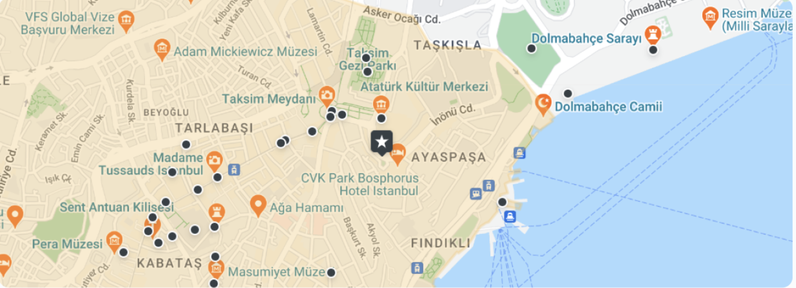

[](https://classroom.github.com/a/q7-BXQLg)


index.html has all the mainn html components
icons have all the assets
all buttons are linked to index.html by default
basics html and forms and inline CSS is used


Requirements:

The goal of this assignment is to learn about HTML elements and attributes.
Should use an HTML form element for the form section.
CSS and JavaScript are not required even if the page does not look like the mock image.
Layout and styling are not required.
You should not use the Table element for formatting.
You should add code documentation using HTML comments.
You should push the assignment to the main branch of the assignment repo. Do not submit it on the canvas.
It doesn't matter if your page does not look aligned, styled, or even ugly.
Your assignment will be assessed only based on the HTML elements and their attributes used.
Use the right HTML form validations available for each input element type. Refer https://developer.mozilla.org/en-US/docs/Learn/HTML/Forms/Form_validationLinks to an external site..
For images, use any image from the web.


# Project Name
This repository contains the HTML and CSS code for a webpage representing the CVK Park Bosphorus Hotel in Istanbul. This webpage provides information about the hotel, including its location, amenities, available rooms, and reviews.


## Table of Contents
- [Project overview](#project-overview)
- [Getting Started](#getting-started)
 - [Prerequisites](#prerequisites)
 - [file structure](#filestructure)
- [Usage](#usage)


## Project Overview
The Travel Website is a basic web page created to share information about different travel destinations. it consists of basic elements like header, body footer and sections. It includes descriptions, images, and some essential details about each destination. It aims to provide a glimpse of beautiful places and hotels  to visit and inspire users to explore the world.
 This README file will help others understand and use your static HTML web page. the ststic page dsiplays the following contents:
 CVK Park Bosphorus Hotel Istanbul
This repository contains the HTML and CSS code for a webpage representing the CVK Park Bosphorus Hotel in Istanbul. This webpage provides information about the hotel, including its location, amenities, available rooms, and reviews.

Table of Contents
Overview
Available Rooms
Location/Map
Amenities
Reviews
Subscribe Newsletter
Overview
The CVK Park Bosphorus Hotel Istanbul is located in the heart of Istanbul, in the Taksim Gmsuyu area. The hotel offers 452 luxurious rooms and suites, a 8500 m2 SPA and fitness area, 18 meeting rooms, and 3 terraces with Bosphorus views. The hotel is equipped with the latest technology infrastructure and aims to be a popular attraction in the city.

Available Rooms
Superior Bedroom - 1 double bed or 2 twin beds
Price: $240/night
Superior room - City view - 1 double bed or 2 twin beds
Price: $280/night
Superior room - City view - 1 double bed or 2 twin beds
Price: $320/night
Superior room - City view - 1 double bed or 2 twin beds
Price: $350/night
Location/Map
Address: Gummussuyuh Mah, Inonu Cad.No:8 Istanbul 34437
View on Google Maps


Amenities
The hotel offers a range of amenities, including:

Outdoor pool
Indoor pool
Spa and wellness center
Restaurant
Room Service
Fitness center
Bar lounge
Free Wifi
Tea/coffee machine
See More Amenities

Reviews
Check out some of the reviews from guests who have stayed at the CVK Park Bosphorus Hotel Istanbul:

5.0 Amazing | Omar Siphron

"Lorem ipsum dolor sit amet, consectetur adipiscing elit, sed do eiusmod tempor incididunt ut labore et dolore magna aliqua."
5.0 Amazing | Cristofer Ekstrom Bothman

"Lorem ipsum dolor sit amet, consectetur adipiscing elit, sed do eiusmod tempor incididunt ut labore et dolore magna aliqua."
5.0 Amazing | Kalya Lubin

"Lorem ipsum dolor sit amet, consectetur adipiscing elit, sed do eiusmod tempor incididunt ut labore et dolore magna aliqua."
5.0 Amazing | Erin Septimus

"Lorem ipsum dolor sit amet, consectetur adipiscing elit, sed do eiusmod tempor incididunt ut labore et dolore magna aliqua."
5.0 Amazing | Terry George

"Lorem ipsum dolor sit amet, consectetur adipiscing elit, sed do eiusmod tempor incididunt ut labore et dolore magna aliqua."
Subscribe Newsletter
Stay updated with the latest travel discounts, tips, and behind-the-scenes stories from The Travel by subscribing to our newsletter.

To subscribe, enter your email address and click "Subscribe."

Feel free to explore the code and customize it to suit your needs. Enjoy working with this webpage template


## Getting Started

cloned the repo to VS code locally and used it to further add iterations to it,
Finally pushed it back to main repository
git clone link: https://github.com/info-6150-fall-2023/assignment-2-SHubham290646.git

### Prerequisites

List any software or dependencies that users need to have installed before they can use your project. For example:

- Web browser (e.g., Safari,Chrome)
- Text editor (e.g., Visual Studio Code)

## Usage

   git clone link  https://github.com/yourusername/your-project.git

Here is a list of HTML tags used in the basic travel globe website:

<!DOCTYPE html> - Defines the document type and version of HTML.

<html> - The root element that contains all other HTML elements.

<link> - Used to link an external stylesheet (style.css in this case) to the HTML document.

<head> - Contains metadata about the document, including the page title.

<title> - Sets the title of the web page displayed in the browser's title bar or tab.

<body> - Contains the main content of the web page.

<section> - Defines a section of content within the page.

 - Embeds images in the web page.

<a> - Creates hyperlinks to other web pages or resources.

<button> - Defines a clickable button.

<nav> - Represents navigation links.

<ol> - Defines an ordered (numbered) list.

<li> - Defines list items within ordered or unordered lists.

<h1>, <h4> - Headings of various levels, from h1 (highest) to h4 (lower).

<p> - Defines paragraphs of text.

<font> - Used for font-related styling (deprecated in HTML5; use CSS for styling).

<br> - Inserts a line break within text.

<ul> - Defines an unordered (bulleted) list.

<ul> - Defines an unordered (bulleted) list.

<form> - Used to create forms for user input.

<input> - Defines an input field within a form.

<li> - Defines list items within ordered or unordered lists.

<footer> - Defines the footer section of the web page.


# Custom CSS Styles

This CSS file contains a collection of custom styles for various elements of a website. It provides styling for navigation bars, page layout, text, buttons, and more.

## Key Features:
- **Flexbox Layout:** Flexbox is extensively used for creating responsive and flexible layouts.

- **Styling for Navigation:** There are styles for navigation bars, including hover effects and alignment.

- **Typography:** Custom typography styles such as font weights and sizes are applied.

- **Color Schemes:** Colors are defined, including highlight colors in crimson and green.

- **Buttons:** Styles for buttons, including hover effects, are included.

- **Review Elements:** Styles for review sections, icons, and ratings are defined.

- **Amenities:** Styles for displaying amenities and room details.

- **Location Map:** Styles for displaying location maps and buttons.

- **Cards:** Styles for cards with shadows and rounded corners.

## How to Use:
1. Included this CSS file in our HTML document using a `<link>` tag in the `<head>` section.

   ```html
   <link rel="stylesheet" type="text/css" href="your-styles.css">


This README file provides an overview of the custom CSS file's features, usage instructions, and customization guidelines. It also mentions that the CSS code is open for use, modification, and distribution without attribution but should be tailored to fit specific project requirements.


# mango-project

